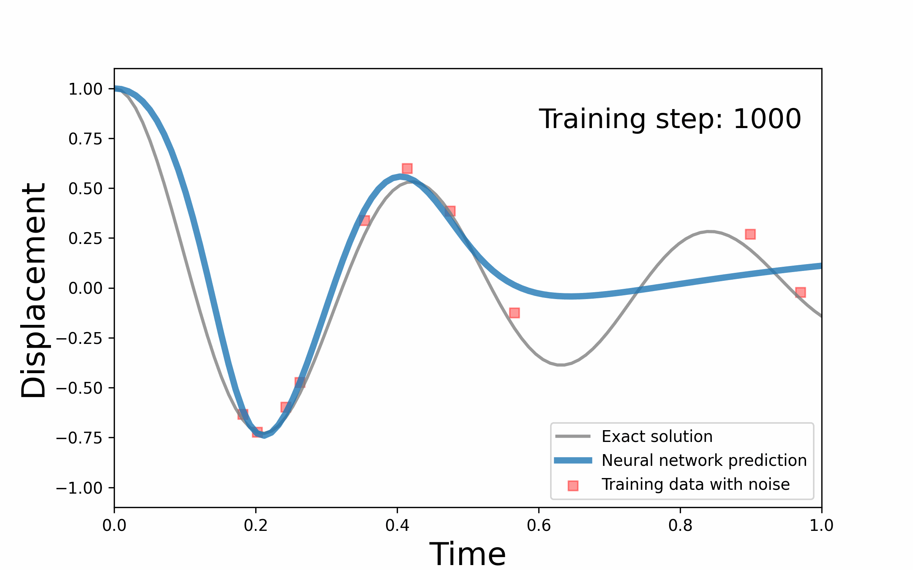

# pinn_damped-harmonic-oscillator
>>This project addressed inverse problem of PINN (Physical Informed Neural Network).

This example predicts the exact ODE equation and the corresponding solution for damped harmonic oscillator when a few noisy data is given.
To alleviate the nosie effect, we update the loss function at each epoch using sigmoid fuction. Our network concentrates the noisy data to approximate the solution in early training steps, while the influence of the ODE is emphasized in later steps. Hence, our network can effectively search the exact solution and the ODE.

For forward problem of PINN, See https://github.com/johninkorea/CAC23_parallel_computing/tree/main

For description of damped harmonic oscillator, See https://beltoforion.de/en/harmonic_oscillator/

