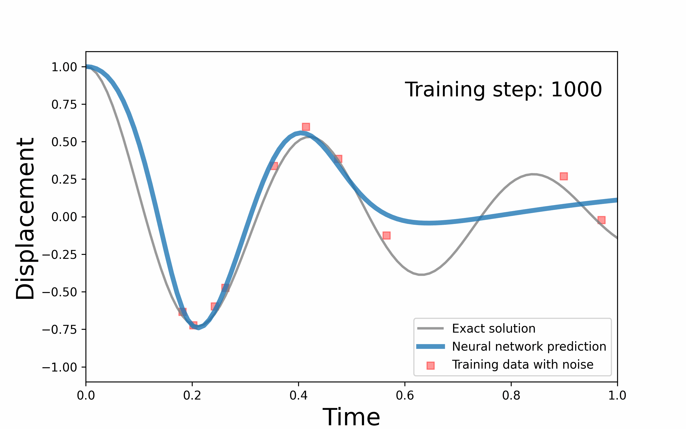

# pinn_damped-harmonic-oscillator
PINN (Physical Informed Neural Network)
In this project, we addressed inverse problem of PINN.
That is, if we got some data (with or without noise), this network predict not only an ODE solution but also an ODE equation.

Here, I gave you an example dealing a few noise data to predict the exact ODE eaquation and soultion.

